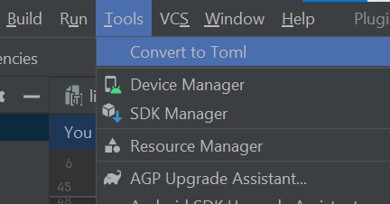
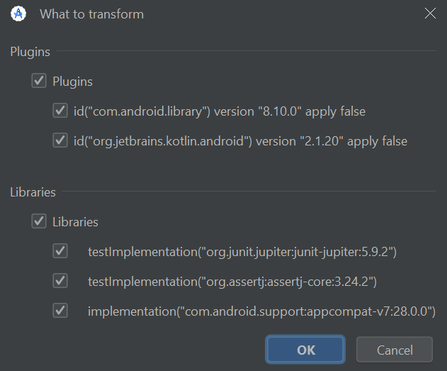
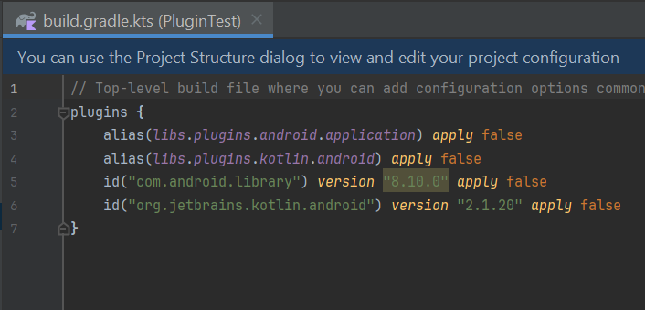
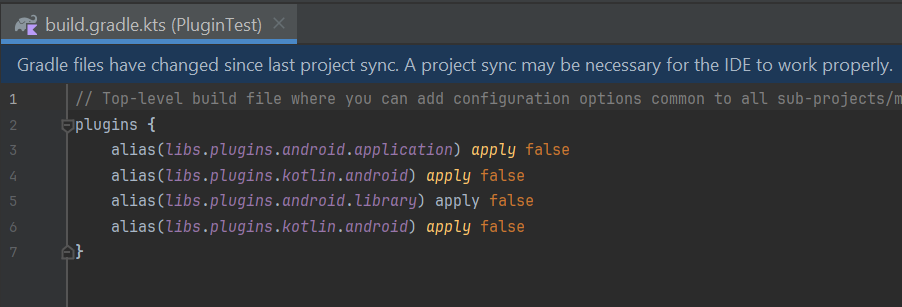
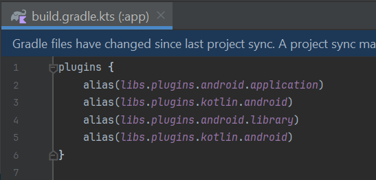
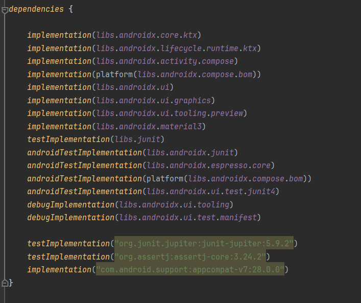
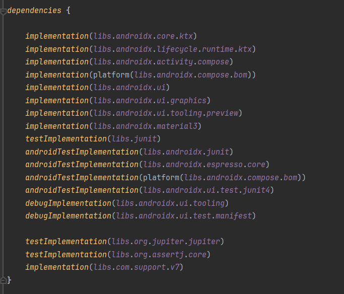

# Convert to toml vers plugin

## Content
- [Description](#description)
- [Technologies](#technologies)
- [Installation](#installation)  
- [Usage](#Usage)
- [Usage Exapmle](#usage-example)
- [Compatibility ](#compatibility)

## Description
The **Convert to TOML Plugin** for IntelliJ IDEA allows you to quickly convert dependencies from your Gradle project files into TOML format. This plugin is designed to make it easier to manage your project dependencies by transforming them into a standardized format compatible with various tools and systems that use TOML.

## Technologies
- Koin
- Kotlin UI DSL
- Kotlin

## Installation

To install the plugin, follow these steps:
1. Download the `.zip` plugin file from the [releases page](https://github.com/Balalaika73/TomlConvertPlugin/releases).
2. In Android Studio, go to **File → Settings → Plugins**.
3. Click on ⚙️
4. Click on **Install Plugin from Disk...**.
5. Select the downloaded `.zip` file.
6. Restart Android Studio to activate the plugin.

## Usage

Once the plugin is installed:
1. Go to **Tools** in the top menu.
2. Click the **Convert to TOML** item.
3. Select lines from the dialog window.
4. Click **Ok**.
5. The plugin will convert all selected dependencies in your `build.gradle.kts` into TOML format.
6. Check the changes in the `build.gradle.kts` and `libs.version.toml` files.
7. Click **Sync Now** to apply the changes.

## Usage Example

Button location:

Example of dialog window:

Before plugins convert in Project level:

After plugins convert in Project level:

After plugins convert in Module level:

Before dependencies convert:

After dependencies convert:

## Compatibility

- IntelliJ IDEA version: 2024.1 and above (maybe)
- Android Studio version: 2024.1 and above (maybe)
